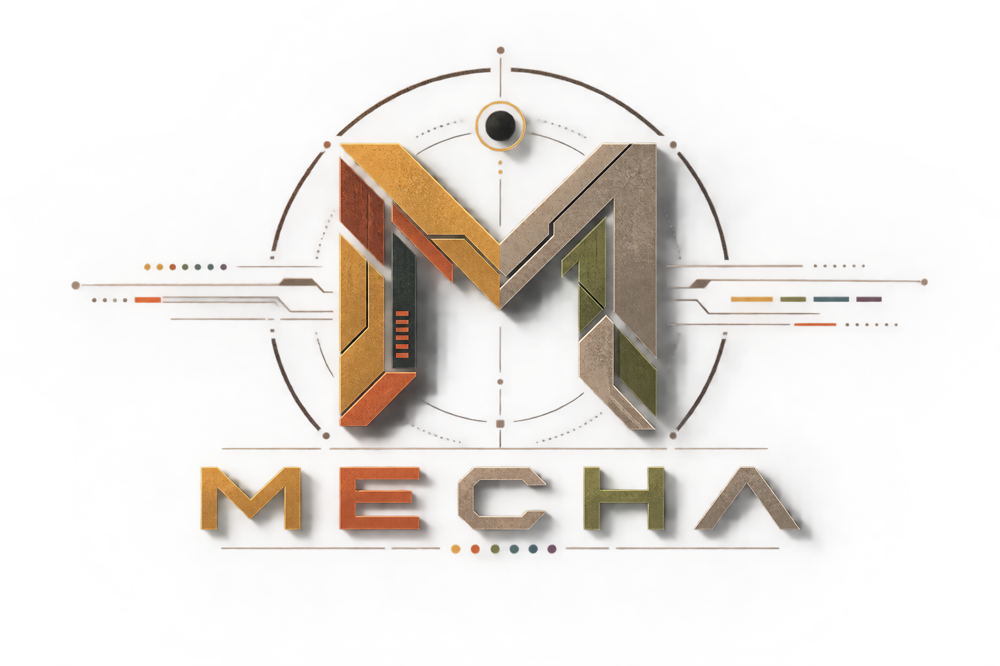

<p align="center">
  
</p>

<h1 align="center">Personal Dotfiles</h1>

<p align="center">
  Omarchy × Doom Emacs
</p>


# Personal Dotfiles

This README serves primarily as a reference for the configuration: what it is built on, how the different pieces fit together, and the ideas behind the workflows.

---

# Installation

Clone the repository:

```bash
git clone https://github.com/purdobol/mecha
cd mecha
```

Then run the installation script:

```bash
./install.sh
```

The installer handles copying the repository configuration into the appropriate locations and creates backups of existing files before replacing them.

The current installation covers:

* Home directory configuration files
* Doom Emacs configuration
* Omarchy / Hyprland configuration
* Omarchy hooks
* `keyd` configuration
* Automatic backups of existing configuration files
* Reloading `keyd` when applicable

Backups are stored under:

```text
~/.dotfiles-backup/<timestamp>/
```

The installer is intended to be safe to run on an existing configuration: files that would be overwritten are backed up first.

> **TODO:** Consider switching the installation and management system to [yadm](https://github.com/yadm-dev/yadm). Its profile support and encryption features could be useful as the configuration grows.

---

# Integration

The main goal is to make Omarchy and Doom Emacs feel like a single cohesive environment.

Rather than treating Emacs as just another application that has to be opened before its workflows become available, the configuration brings Emacs functionality out into the desktop itself.

Many of these workflows are exposed directly through **Omarchy's global keybindings**, making them accessible from anywhere in the system. The keybindings act as entry points into Emacs-powered functionality without requiring an existing Emacs window.

Examples include:

* The file manager workflow uses **Dirvish**.
* **Walker remains available**, while `omni-local` provides an Emacs-based alternative for launching and searching.
* Org Capture can be triggered directly from the desktop, regardless of which application currently has focus.
* Captured information can be searched, reviewed, organized and promoted without needing to know which underlying file contains it.
* The Omarchy theme is synchronized with the Emacs theme.

The important idea is that these workflows are **desktop-level functionality backed by Emacs**, rather than features that are only accessible from within Emacs.

The configuration therefore tries to blur the boundary between the Omarchy desktop and Doom Emacs. Emacs becomes part of the desktop's underlying interaction model without requiring the user to explicitly switch into Emacs first.

The goal isn't to replace every application with Emacs simply because it is possible. It is to make Emacs-powered workflows available wherever they provide a useful alternative, while keeping Omarchy as the desktop foundation.

## Theme Integration

Omarchy and Doom Emacs share the same theme integration.

Changing the active Omarchy theme automatically changes the corresponding Emacs theme, keeping the desktop and Emacs visually synchronized.

The Emacs side is based on the `sanityinc-tomorrow` theme, modified to fit the Omarchy environment.

The workflow is demonstrated below:

<video src="VIDEO_URL_THEME_SWITCHING" width="800" controls></video>

---

# omni-local

`omni-local` is the central search and launcher interface for the Emacs side of the desktop.

At its core, **omni-local is consult-omni**, configured and extended for this particular setup.

The underlying [`consult-omni`](https://github.com/armindarvish/consult-omni) package provides the framework for searching and interacting with many different sources through Emacs' completion ecosystem. `omni-local` builds the local desktop experience around it by adding a floating Emacs frame, custom sources, and configuration tailored to the Omarchy + Doom Emacs workflow.

Walker remains available as an alternative. `omni-local` provides a different approach, bringing the Emacs completion ecosystem into the desktop.

A single cohesive floating window provides access to:

* Application launching
* `calc`
* File/Directory search
* Org notes
* Saved web pages
* Org bookmarks
* Denote knowledge
* Custom Search Engines
* Known Projects
* Omarchy menu commands

The important part is that these are not separate interfaces.

Applications, files, notes, tasks, bookmarks, knowledge, and system commands are exposed through the same completion interface.

Because `omni-local` is built directly around `consult-omni` and the Emacs completion ecosystem, it benefits from narrowing, actions, annotations, Embark, and the rest of the Consult ecosystem.

The result is a system-wide interface for **finding and acting on things**, regardless of what those things actually are.

> **One interface for finding things, regardless of where they live.**

<video src="VIDEO_URL_OMNI_LOCAL" width="800" controls></video>

---

# omni-local + Omarchy

`omni-local` is not limited to launching applications or searching personal information. Omarchy functionality is also exposed through the same interface.

This allows functionality normally provided by the Omarchy menu to become another searchable/actionable source within `omni-local`.

The integration includes commands such as:

* Locking the screen
* Launching the screensaver
* Toggling Waybar
* Setting Reminder
* Other Omarchy commands and desktop actions

The idea is to make Omarchy functionality feel like part of the same interface rather than requiring a separate menu.

<video src="VIDEO_URL_OMNI_OMARCHY" width="800" controls></video>

---

# Capture From Anywhere

The Org Capture system is another important part of the configuration.

Capture is designed to work independently of the application currently in use. There is no requirement to already be inside Emacs.

Configured capture workflows include:

* Tasks
* Notes
* Contacts
* Bookmarks
* RSS for Elfeed
* Web pages (saving an entire web page and processing it into Org file)


Wayland clipboard integration allows surrounding context to be captured as part of these workflows without requiring manual movement of information between applications.

The capture workflows can be accessed directly through the global Omarchy keybindings, meaning they remain available regardless of which application currently has focus.

The demo below shows several of these workflows, including task and note capture, clipboard-based context capture, and fetching and converting a web page into Org.

<video src="VIDEO_URL_ORG_CAPTURE" width="800" controls></video>

---

# Org Browser

Once information can be captured from anywhere, a second problem appears:

**How should all of that captured information be viewed and managed?**

The answer is **Org Browser**.

Org Browser provides a simple interface for viewing and managing the temporary Org capture structure without requiring knowledge of which file contains a particular item.

It uses a two-pane layout:

```text
┌──────────────────────┬─────────────────────────────────┐
│                      │                                 │
│  Captured items      │  Content                        │
│                      │                                 │
│  My article          │  # My article                   │
│  Buy something       │                                 │
│  John Doe            │  Article content...             │
│  Interesting idea    │                                 │
│  Read later          │                                 │
│                      │                                 │
└──────────────────────┴─────────────────────────────────┘
```

The left pane lists captured items while the right pane displays their contents.

Different sources can be switched between without needing to think about the underlying Org files.

### Sources

```text
n  Notes
w  Web pages
t  Tasks
b  Bookmarks
c  Contacts
```

### Actions

```text
s    Filter
/    Filter
C-/  Reset filter

a    Add
m    Mark
x    Delete marked
d    Delete current
e    Edit
p    Promote
RET  Open
q    Quit
```

Filtering supports both names and tags.

The result is effectively an inbox for information captured throughout the system.

The demo below showcases switching between sources, reviewing captured items, filtering, marking entries, and deleting items.

<video src="VIDEO_URL_ORG_BROWSER" width="800" controls></video>

---

# Capture → Review → Knowledge

One of the more important architectural ideas is that **not everything captured in Org needs to become permanent knowledge**.

Org acts as a temporary information layer.

The workflow is:

```text
                 CAPTURE
                    │
                    ▼
              Temporary Org
                    │
                    ▼
                Org Browser
                    │
          ┌─────────┴─────────┐
          │                   │
       discard             promote
          │                   │
          ▼                   ▼
        delete              Denote
                              │
                              ▼
                         ~/Knowledge/
```

This creates a deliberate distinction between **captured information** and **knowledge worth keeping**.

Information can be captured quickly without making an immediate decision about its long-term destination.

During review, an item can be:

* deleted
* edited
* left as temporary information
* promoted into the permanent Denote knowledge base

This keeps capture lightweight while making the later organization process explicit.

---

# Promotion to Denote

The promotion workflow converts a temporary Org entry into a permanent Denote note.

The process roughly works as follows:

1. Extract the relevant Org subtree.
2. Remove the temporary headline.
3. Remove property drawers.
4. Remove standalone timestamps.
5. Clean up tags.
6. Create a new Denote note.
7. Copy the cleaned content into it.
8. Record the resulting Denote destination back in the original Org entry.

This establishes a clear separation between **temporary capture** and **curated permanent knowledge**.

The capture layer can remain messy and flexible, while the knowledge base contains only information that has gone through the review process.

---

# Architecture

At a high level, the configuration can be viewed as several layers:

```text
┌─────────────────────────────────────────────┐
│                   Omarchy                   │
│              Desktop foundation             │
└──────────────────────┬──────────────────────┘
                       │
                       ▼
┌─────────────────────────────────────────────┐
│                Emacs / Doom                 │
│          Interaction & information          │
└──────────────────────┬──────────────────────┘
                       │
          ┌────────────┼────────────┐
          ▼            ▼            ▼
     omni-local    Org Capture   Org Browser
          │            │            │
          │            ▼            │
          │      Temporary Org ◄────┘
          │            │
          │            ▼
          │          Denote
          │            │
          │            ▼
          │       ~/Knowledge/
          │
          ▼
     System-wide
      searching
```

The individual components have different responsibilities:

**Omarchy**
Provides the desktop, window management, Wayland environment, global keybindings, and general system foundation.

**Doom Emacs**
Provides the main Emacs environment and the framework for integrating the different information workflows.

**omni-local / consult-omni**
Provides a unified interface for launching applications and searching across different types of information.

**Org Capture**
Provides the system-wide capture layer.

**Org Browser**
Provides the review and management layer for captured information.

**Denote**
Provides the permanent knowledge layer.

---

# Keyd & Keyboard Layer

A major part of the configuration is the use of **[keyd](https://github.com/rvaiya/keyd)** to turn the keyboard into another layer of the desktop interaction system.

The main idea is to make **Caps Lock the primary modifier key**.

Caps Lock acts as a dual-purpose key:

* **Tap** → `Escape`
* **Hold** → activates the custom `symbols` layer


The `symbols` layer maps keys to combinations of:

```text
Shift + Alt + Super + <key>
```

For example:

```text
Caps + A      → Shift + Alt + Super + A
Caps + 1      → Shift + Alt + Super + 1
Caps + Enter  → Shift + Alt + Super + Enter
```

This provides a dedicated shortcut layer that works consistently across the desktop while leaving applications free to decide what those combinations do.

The layer is particularly useful together with Omarchy's global keybindings. Instead of relying on multiple physical modifier combinations, the keyboard provides a dedicated, easily accessible layer for system-wide actions.

### Modifier Remapping

The configuration also remaps the left-side modifiers:

```text
Left Control → Left Super
Left Alt     → Left Control
Left Super   → Left Alt
```

This effectively rotates the three left modifier keys:

```text
Physical key       Result

Left Control   →   Left Super
Left Alt       →   Left Control
Left Super     →   Left Alt
```

Together with the Caps Lock layer, this creates a keyboard layout designed around the shortcut-heavy workflow used throughout the Omarchy and Emacs configuration.

The important distinction is that **Caps Lock is not simply remapped to another modifier**. It is implemented as an `overload`: its behavior depends on whether the key is tapped or held.

The relevant configuration lives in:

```text
system/keyd/default.conf
```

The installer places it at:

```text
/etc/keyd/default.conf
```

and restarts `keyd` when the service is available.

> **Caps Lock becomes the primary gateway into the custom keyboard layer, while the traditional modifier keys are rearranged to better fit the overall shortcut layout.**

---

# Global Keybindings

The Omarchy / Hyprland configuration provides a common shortcut layer for launching both regular desktop applications and Emacs-powered workflows.

The important part is that **the same global keybinding layer is used to expose functionality regardless of whether the implementation is an external application or an Emacs command**.

With the `keyd` keyboard layer, the main global modifier combination is exposed as **Caps Lock + key**.

Some of the most relevant bindings are:

| Shortcut       | Action              |
| -------------- | ------------------- |
| `Caps + E`     | Open / focus Emacs  |
| `Caps + C`     | Org Capture         |
| `Caps + R`     | `omni-local`        |
| `Caps + F`     | Dirvish             |
| `Caps + F`     | Dirvish             |
| `Caps + O`     | Org Browser         |
| `Caps + W`     | Elfeed              |
| `Caps + Enter` | Terminal            |
| `Caps + B`     | Browser             |
| `Caps + M`     | Music               |
| `Caps + N`     | Editor              |
| `Caps + D`     | Docker / Lazydocker |
| `Caps + /`     | Password manager    |
| `Caps + A`     | ChatGPT             |
| `Caps + Y`     | YouTube             |
| `Caps + S`     | Web search          |
| `Caps + Q`     | Close window        |
| `Caps + 1-9`   | Change Workspace    |

The Emacs-related bindings are particularly important:

```text
Caps + C  →  Org Capture
Caps + R  →  omni-local
Caps + F  →  Dirvish
Caps + O  →  Org Browser
Caps + W  →  Elfeed
```

This is what allows the Emacs-powered information system to remain accessible from anywhere in the desktop rather than being tied to an active Emacs window.

The underlying Hyprland configuration uses the modifier combination generated by the `keyd` layer. The physical implementation is therefore separate from the interface presented to the user: **Caps Lock is the primary modifier, while Hyprland receives the corresponding modifier combination underneath**.

Workspace switching and window-management bindings remain part of the Hyprland configuration but are not considered part of the core Emacs integration described here.

---

# Credits, Inspiration & Acknowledgments

This configuration stands heavily on the work of projects and people who have already solved much of the difficult part.

Rather than rebuilding everything from scratch, the configuration takes strong existing foundations and adapts them into a single Omarchy + Doom Emacs workflow.

### Foundations

* **[Omarchy](https://github.com/basecamp/omarchy)** — the desktop foundation. Its opinionated approach to a modern Linux desktop provides the base on which this configuration is built.

* **[Doom Emacs](https://github.com/doomemacs/core)** — the foundation for the Emacs configuration and broader Emacs environment. Doom provides the modular framework and sane defaults that make building a large Emacs setup considerably easier.

### Core Components

* **[consult-omni](https://github.com/armindarvish/consult-omni)** — the core of `omni-local`. `omni-local` is essentially a local, opinionated configuration of `consult-omni`, adding the floating frame, custom sources, and integrations needed for this particular desktop workflow. Huge credit to the excellent work behind consult-omni.

* **[Denote](https://github.com/protesilaos/denote)** — the foundation of the permanent knowledge layer. Denote provides the simple, file-based approach to personal knowledge management that fits particularly well with the capture → review → promote workflow.

### Theme

* **[Mechanoonna](https://github.com/HANCORE-linux/omarchy-mechanoonna-theme)** — the Omarchy theme used as the visual foundation for the desktop. The theme is also part of the inspiration for the Omarchy ↔ Emacs theme integration.

* **[sanityinc-tomorrow](https://github.com/purcell/color-theme-sanityinc-tomorrow)** — the base theme used for Emacs. It is modified to fit the Omarchy environment, but remains the underlying theme and starting point.

### Inspiration

* **[Josh Blais' NixOS configuration](https://github.com/joshuablais/nixos-config/blob/master/dotfiles/hypr/scripts/emacs-launcher.go)** — an important inspiration for the idea of integrating Emacs deeply into the desktop and exposing Emacs functionality through system-level interactions rather than limiting it to an Emacs window.

The broader philosophy is also influenced by the many Emacs configurations and Linux desktop setups that demonstrate the value of building on strong foundations instead of maintaining every component independently.

---

# TODO & Future Considerations

This configuration is intentionally evolving. Some of the ideas below are implemented only partially, while others are directions worth exploring.

### Desktop Integration

* Further synchronize Omarchy and Emacs themes.
* Expose more Emacs workflows through Omarchy global keybindings.
* Replace additional system workflows with Emacs equivalents where the integration actually improves the experience.
* Continue refining the relationship between `omni-local`, Walker, and the Omarchy menu.
* Improve consistency between system-level and Emacs-level keybindings.
* Investigate **[omarchy.el](https://github.com/ovistoica/omarchy.el)** as a possible alternative or improvement to the current Omarchy → Emacs theme integration. This needs to be properly tested and evaluated before deciding whether to adopt it.

### omni-local

* Add more useful search sources.
* Improve source prioritization and narrowing.* Expand integration with Omarchy desktop actions.
* Continue refining the floating interface and overall interaction model.

### Configuration Management

* Consider switching to **[yadm](https://github.com/yadm-dev/yadm)** for dotfile management.
* Evaluate its profile support for managing different configurations or machine-specific variations.
* Evaluate its encryption support for handling sensitive configuration or secrets.
* Determine whether the additional abstraction is worthwhile compared with the current custom installer.

### Longer-term Ideas

* Use Emacs as the interface for more desktop-level workflows where it provides a clear advantage.
* Reduce the number of separate interfaces needed to interact with personal information.
* Explore deeper integration between browser history, bookmarks, saved pages, and the Org/Denote system.
* Integrate more external information sources into the same search and completion interface.
* Continue experimenting with the idea of **Emacs as an information layer for the entire desktop**, rather than simply an editor.

The TODO list is intentionally more of a collection of directions than a strict roadmap. Some ideas may turn out not to be worth implementing once they meet the reality of daily use.

---

# Philosophy

This repository is intentionally **not** another attempt to build a Linux desktop completely from scratch.

Custom Arch Linux and Emacs configurations are fun, but maintaining every component independently eventually becomes a project in itself.

Using strong foundations makes it possible to focus on the interesting part: **how the pieces interact**.

Omarchy provides a well-designed and actively maintained desktop foundation.

Doom Emacs provides an incredibly flexible environment for working with information.

The rest of this configuration focuses on connecting those systems.

The desired result is a desktop where launching an application, searching for a file, finding a note, capturing an idea, reviewing a web page, managing a task, or searching the knowledge base feel like different operations within the same environment rather than completely separate workflows.

The central ideas are:

> **Capture everything easily.**
> **Organize it later.**
> **Keep only what matters.**
> **Make the whole desktop work together.**

This configuration is an ongoing experiment, and individual implementations will change over time. The underlying architecture and workflows are the main things this README is intended to document.
